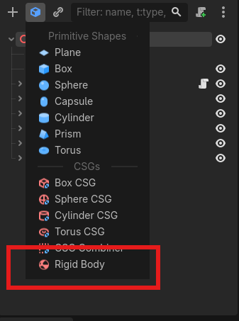
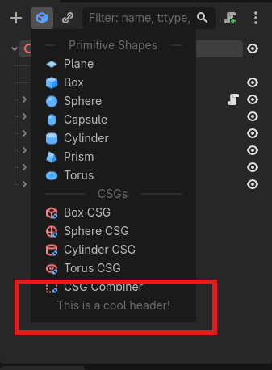

# Quick Add Menu

A Godot plugin that adds a drop down menu in the scene dock which gives quickly accessible nodes that can be added to your scene.

It can be expanded to include your own custom nodes as well.

The menu's items depend on the type of node you have selected.

# Customization

You can customize the Quick Add menu with different function calls inside and out of the `quick_add_menu.gd` `add_custom_items()` function.

The best place to start is inside of the `add_custom_items()` function if you do not have your own editor plugin.

## Custom Items

Items within the quick menu consist of a `String` `name`, an `Texture2D` `icon`, and a `Callable` for creating the nodes  

The callable needs to return an `Array[Node]` to work.

The first element of the returned array will be the first node added, and nodes afterwards in the array will be children of that node.  

```gdscript
func add_custom_items(): ## Add custom items
    var item = QuickAddMenu.Item.new("Rigid Body", load("res://RigidBody3D.svg"), func(): return [RigidBody3D.new()] as Array[Node])
    QuickAddMenu.node_3d_list.append(item)
```

or one with children:  

```gdscript

func rigidbody() -> Array[Node]:

    var body:RigidBody3D = RigidBody3D.new()
    var collider:CollisionShape3D = CollisionShape3D.new() # Child of body
    
    collider.shape = BoxShape3D.new()

    return [body, collider]

func add_custom_items(): ## Add custom items
    var item = QuickAddMenu.Item.new("Rigid Body", load("res://RigidBody3D.svg"), rigidbody)
    QuickAddMenu.node_3d_list.append(item)
```

This code should end up looking like this:

<p>
  
</p>

## Custom Headers

Headers within the quick menu consist of a `String` `name`, an `Texture2D` `icon`  

```gdscript
func add_custom_items(): ## Add custom items
    var header = QuickAddMenu.Item.new_header("This is a cool header!")
    QuickAddMenu.node_3d_list.append(header)
```

This code should end up looking like this:

<p>
  
</p>


